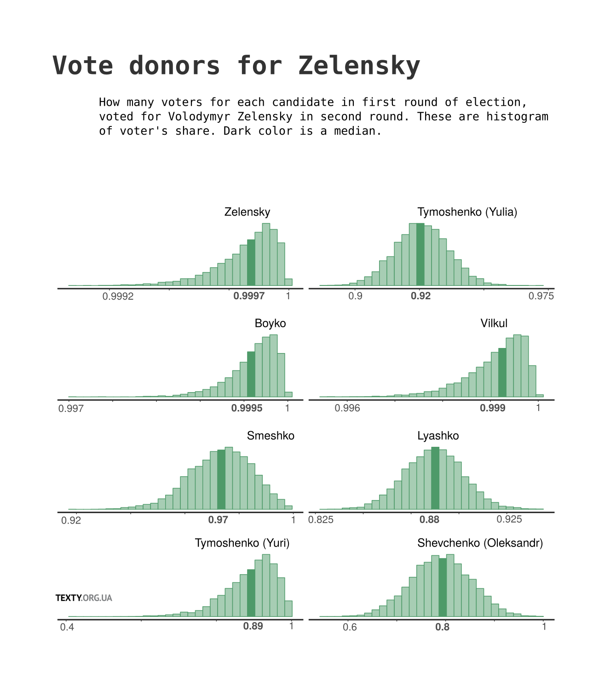
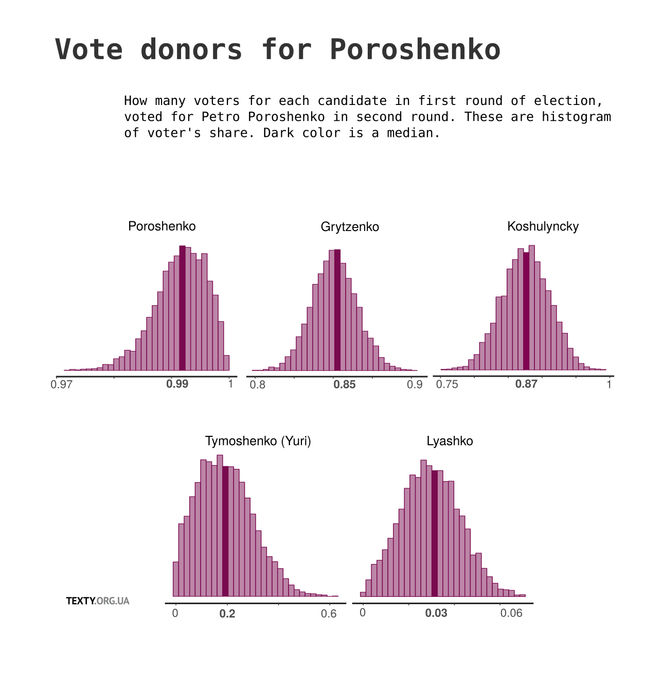

# bayes_vote_transfer 
Use bayesian linear regression to find how many voters for each candidate in first round of election, voted for candidate X in second round?  Based on real data from each poll station on Ukrainian presidential election-2019.

What are the assumptions of a model:
* all standart assumptions for bayesian linear regression
* there are different levels of support for each candidates in second round from different group of voters in first round (each group - voters who voted for some candidate) (uniforms as priors)
* turnout modelled for each such group as different parameters, too (student as priors)
* final share of voters for candidate Z from first tour, who voted for candidate X in second, is a multiple of level of support for candidate X and turnout for this group of voters:  total_x * turnout 
* finally,  on each poll station, sum of all total_x[i] * turnout[i] * votes_from_first_round[i] == number of votes for X in second round, where i - index of each different group of voters, and votes_from_first_round[i] - rezult for group i on this station. 

## Result for Zelensky

## Result for Poroshenko 

Also, see here in Ukrainian: http://texty.org.ua/pg/article/devrand/read/93486/
                             http://texty.org.ua/pg/article/editorial/read/93795
                             
[слайди](https://docs.google.com/presentation/d/1cYotHWWZKman5_vH4eT6vHfN0hmTMbKQhwrmLt8plvk/edit?usp=sharing)                             
